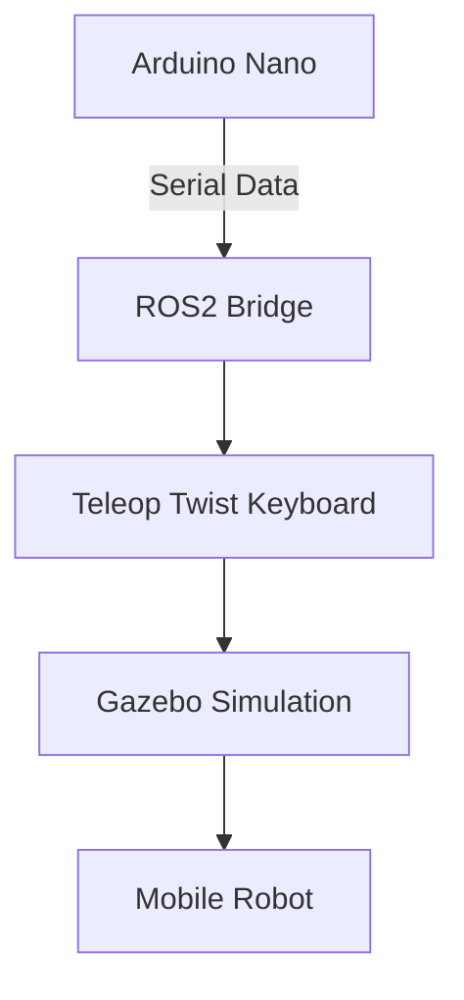

# Gesture Based Mobile Robot Control in ROS 🚗⚡

**ROS2 Jazzy Package for Mobile Robot Control Using Sensor Fusion-Powered Hand Gestures**  
*Part of Undergraduate Thesis: "A Bimanual Gesture Interface for ROS-Based Mobile Manipulators Using Edge-AI and Sensor Fusion"*

[](https://docs.ros.org/en/jazzy/)
[](https://opensource.org/licenses/Apache-2.0)

A ROS2 Jazzy package for controlling a differential drive robot in Gazebo using an Arduino Nano with ADXL335 accelerometer and flex sensors.

## 📋 Project Overview
- **Gazebo Simulation**: Differential drive robot in 3D environment
- **Arduino Interface**: 
  - ADXL335 accelerometer for directional control
  - Flex sensors for acceleration/deceleration
- **ROS2 Bridge**: 
  - Serial communication between Arduino and ROS2
  - Custom keyboard input translation
  - Gazebo-ROS2 integration

## 🛠️ Prerequisites
- **OS**: Ubuntu 24.04 LTS
- **ROS2**: Jazzy Jalisco ([Installation Guide](https://docs.ros.org/en/jazzy/Installation.html))
- **Arduino IDE** ([Installation Guide](https://www.arduino.cc/en/software))
- **Python Packages**:
  ```bash
  sudo apt install python3-pynput python3-serial
  ```
- **ROS2 Packages**:
  Install the required Gazebo version for the ROS2 Jazzy (Gazebo Harmonic) and the teleop_twist_keyboard.

## 🔌 Hardware Setup
### Circuit Connections
**Arduino Nano Pinout**:
| Sensor       | Arduino Pin |
|--------------|-------------|
| ADXL335 X-Axis | A3          |
| ADXL335 Y-Axis | A2          |
| Flex Sensor 1  | A0 (Accelerator) |
| Flex Sensor 2  | A4 (Decelerator) |

Circuit Diagram will be added soon!

## ⚙️ Installation
1. Clone the repository:
   ```bash
   git clone https://github.com/NajeebAhmedBhuiyan/Gesture-Based-Mobile-Robot-Control-in-ROS.git
   ```
2. Build the ROS2 workspace:
   Put the `mobile_robot` folder into the `src` file of your ros2 workspace and build it.
   ```bash
   cd ros2_ws/
   colcon build --packages-select mobile_robot
   source install/setup.bash
   ```
3. Install Arduino dependencies:
   - Connect Arduino Nano via USB
   - Install required libraries in Arduino IDE:
     - No special libraries needed for basic analog reading

## 🚀 Usage
1. Flash the Arduino code via the arduino IDE.
2. Launch the simulation:
   ```bash
   ros2 launch mobile_robot gazebo_model.launch.py
   ```
3. Control modes:
   - **Tilt Control**:
     - Forward/Backward: Tilt X-axis
     - Left/Right: Tilt Y-axis
     - Idle: Robot Stays Idle
   - **Flex Sensors**:
     - Bend Accelerator sensor to speed up
     - Bend Decelerator sensor to slow down

## 🧩 System Architecture


## 🚨 Troubleshooting
1. **Serial Port Permissions**:
   ```bash
   ls /dev/ttyUSB*
   sudo chmod 666 /dev/ttyUSB0
   ```
2. **Missing Python Packages**:
   ```bash
   sudo apt install python3-pynput python3-serial
   ```

## 📜 License
Apache License 2.0 - See [LICENSE](LICENSE) file

## 🙌 Contribution
Contributions welcome! Please follow:
1. Fork the repository
2. Create your feature branch
3. Commit your changes
4. Push to the branch
5. Open a pull request
